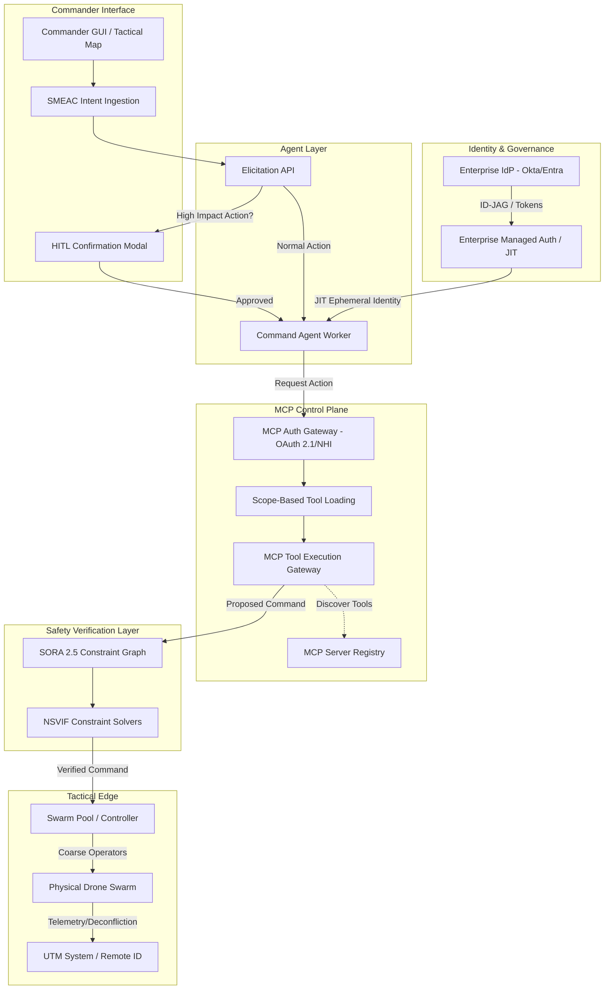
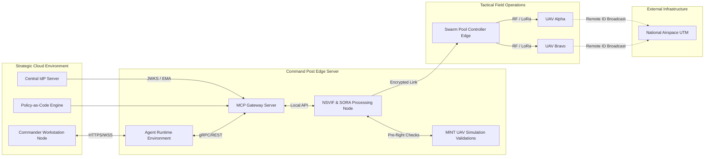
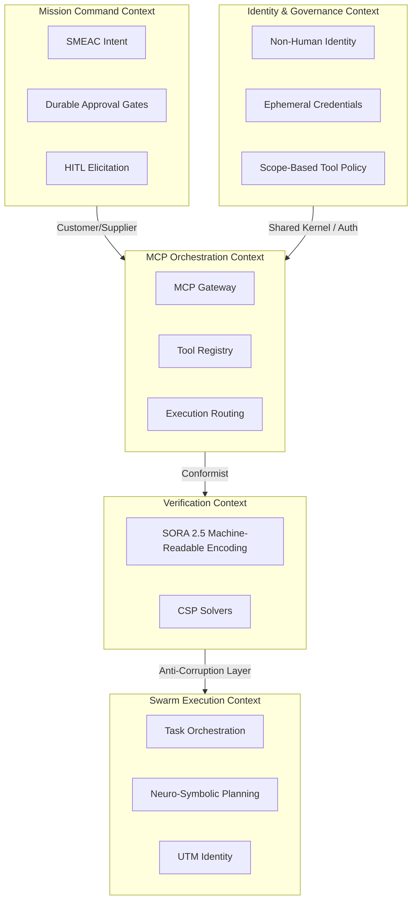

# Intent Swarm Commander — Design Input Diagrams

> Architectural diagrams for the Intent Swarm Commander system.
> Each diagram below is presented as a Mermaid code block followed by key constraints and insights.

---

## 1. System Architecture Diagram (The Compliant Pipeline)

This architecture reflects the mandatory 7-step pipeline required to remediate your initial drafts. It explicitly enforces the **Model Context Protocol (MCP)** as the central control plane and integrates the required safety and identity gateways.

### Key Architectural Constraints

- **HITL Gateway** — Routes high-impact decisions (mass abort, ROE changes) to a human commander prior to execution, fulfilling EU AI Act requirements.
- **Identity Layer** — The Agent receives a cryptographically verified Just-In-Time (JIT) identity to prevent credential sprawl.
- **Formal Verification** — Bypassing direct drone control, commands must satisfy NSVIF solvers and the SORA 2.5 ontology before reaching the Swarm Pool.

---

## 2. Deployment Architecture (Infrastructure Topology)

This defines where these components physically execute, moving from the **strategic cloud** down to the **tactical edge** where the physical swarm operates.

### Deployment Insights

- **MINT Integration** — High-fidelity simulations run at the Command Post Edge to validate tree planning before live execution.
- **Airspace Integration** — Drones broadcast their digital airspace identity directly to external UTM systems for real-time deconfliction.

---

## 3. Domain-Driven Design (DDD) Context Map

To organize the software modules and separate bounded contexts, here is the DDD breakdown. This prevents tight coupling between the user intent, the identity verification, and the physical swarm execution.

### DDD Domain Boundaries

- **Identity & Governance** — Handles OAuth 2.1, Dynamic Client Registration (DCR), and Enterprise-Managed Authorization (EMA).
- **Verification Context** — Exclusively handles the translation of SORA 2.5 safety objectives into machine-readable ontologies and runs the deterministic safety enforcement.
- **Mission Command Context** — Manages durable workflow gates for long-running or multi-day swarm mission plans, allowing commanders to approve or reject plans asynchronously.