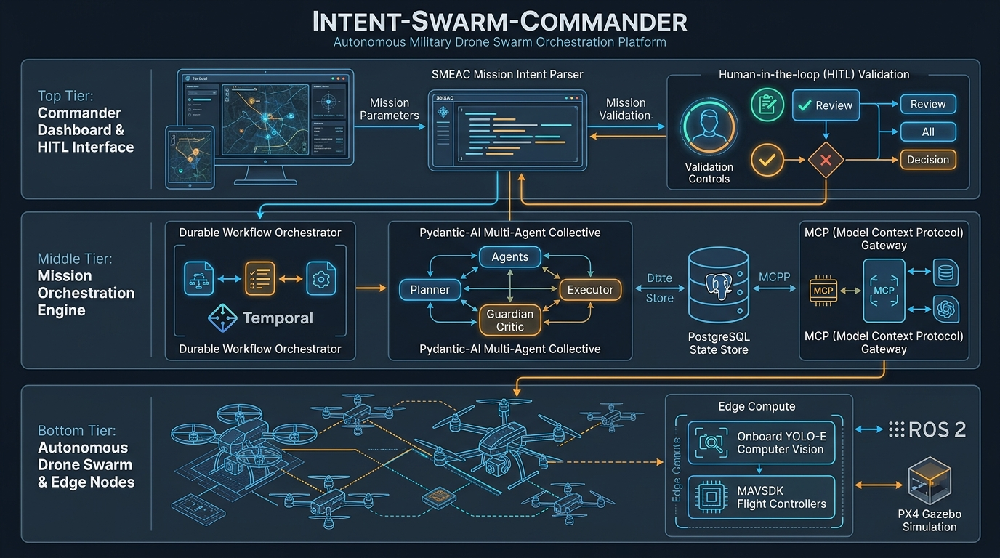
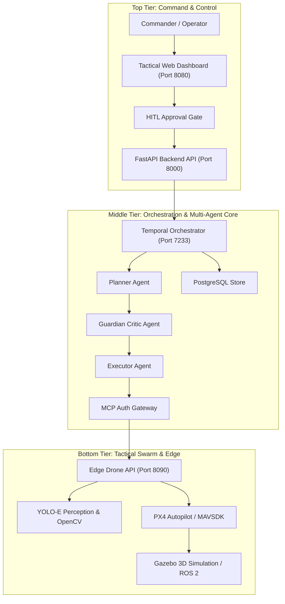

# Intent-Swarm-Commander: System Architecture

## System Overview

**Intent-Swarm-Commander (ISC)** translates high-level military intent orders (**SMEAC**: Situation, Mission, Execution, Administration, Command/Signal) into resilient, coordinated multi-drone operations.

The architecture is partitioned into three decoupled tiers:

### 1. Top Tier: Commander Dashboard & HITL Interface
* **Tactical Web UI**: Leaflet.js map display, real-time telemetry, and operational status (`:8080`).
* **SMEAC Intent Parser**: Ingestion of mission intent parameters and operational constraints.
* **Human-in-the-Loop (HITL) Validation**: Safety gating requiring explicit human approval before irreversible swarm execution.

### 2. Middle Tier: Mission Orchestration Engine
* **Temporal Workflow Engine**: Durable distributed state machine managing order lifecycles, retries, and fail-closed safety (`:7233`).
* **Pydantic-AI Multi-Agent Collective**:
  * **Planner Agent**: Decomposes high-level intent into coarse-grained swarm operators.
  * **Guardian Critic Agent**: Enforces safety, airspace boundaries, and military ROEs (Rules of Engagement).
  * **Executor Agent**: Translates validated plans into dispatchable drone tasks.
* **State Store**: PostgreSQL database backing Temporal state and domain entities (`:5432`).
* **MCP (Model Context Protocol) Gateway**: Standardized tool interface exposing swarm management and sensors over JSON-RPC (SSE/HTTP).

### 3. Bottom Tier: Edge Nodes & Autonomous Drone Swarm
* **Edge Compute (Raspberry Pi 5 / Edge API)**: Edge server (`:8090`) coordinating local drone execution.
* **Onboard Perception**: Real-time object and target identification powered by YOLO-E and OpenCV.
* **Flight Controllers & Autopilot**: MAVSDK communicating with PX4 Autopilot over MAVLink.
* **Simulation & Physics**: ROS 2 bridging with Gazebo 3D simulation for zero-hardware local testing.

---

## Architecture Flow Diagram

