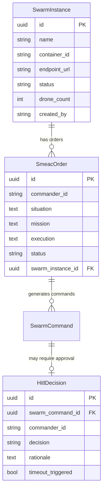

# Data Model: Replace Mocks, Stubs & Hardcodes

**Feature**: [spec.md](file:///home/remi/Projects/Intent-Swarm-Commander/specs/002-replace-mocks-production/spec.md)
**Date**: 2026-07-27

## Overview

This feature does not introduce new entity types — all required ORM models already exist. This document maps the existing data model to the mock-replacement work, identifies any missing fields, and documents state transitions.

---

## Existing Entities (Already Defined)

### SwarmInstance

**ORM**: [instance.py](file:///home/remi/Projects/Intent-Swarm-Commander/src/uservice/swarm/models/storage/instance.py)

| Field | Type | Notes |
|-------|------|-------|
| `id` | UUID (PK) | From `UUIDMixin` |
| `name` | String(255) | Unique, not null |
| `container_id` | String(128) | Nullable — real Docker container ID |
| `endpoint_url` | String(512) | Nullable — container's API endpoint |
| `status` | String | Default `provisioning` |
| `drone_count` | Integer | Not null |
| `created_by` | String(255) | Commander ID from JWT claims |
| `created_at` | DateTime(tz) | From `TimestampMixin` |
| `updated_at` | DateTime(tz) | From `TimestampMixin` |

**State Transitions**:
```
provisioning → ready → active → draining → terminated
provisioning → failed
```

**Mock → Production Change**: Replace in-memory `_swarms` dict with DB queries via `self.session`. Populate `container_id` with real Docker container IDs.

---

### SmeacOrder

**ORM**: [smeac.py](file:///home/remi/Projects/Intent-Swarm-Commander/src/uservice/smeac/models/storage/smeac.py)

| Field | Type | Notes |
|-------|------|-------|
| `id` | UUID (PK) | From `UUIDMixin` |
| `commander_id` | String(255) | From JWT `sub` claim |
| `situation` | Text | Not null |
| `mission` | Text | Not null |
| `execution` | Text | Not null |
| `admin_logistics` | Text | Nullable |
| `command_signal` | Text | Nullable |
| `swarm_instance_id` | UUID (FK → `swarm_instances.id`) | Not null |
| `status` | String | Default `submitted` |
| `created_at` | DateTime(tz) | From `TimestampMixin` |
| `updated_at` | DateTime(tz) | From `TimestampMixin` |

**State Transitions (OrderStatus enum)**:
```
draft → submitted → parsing → translated → verified → pending_hitl → executing → completed
                                                                                → rejected
                                                                                → failed
```

**Mock → Production Change**: Un-comment DB persistence in `SmeacFacade.submit_smeac_order()`. Replace hardcoded `get_order_status` response with real DB query.

---

### HitlDecision

**ORM**: [decision.py](file:///home/remi/Projects/Intent-Swarm-Commander/src/uservice/hitl/models/storage/decision.py)

| Field | Type | Notes |
|-------|------|-------|
| `id` | UUID (PK) | From `UUIDMixin` |
| `swarm_command_id` | UUID (FK → `swarm_commands.id`) | Not null |
| `commander_id` | String(255) | From JWT `sub` claim |
| `decision` | String | `approved` / `rejected` / `timeout_auto_*` |
| `rationale` | Text | Nullable |
| `timeout_triggered` | Boolean | Default `false` |
| `created_at` | DateTime(tz) | From `TimestampMixin` |
| `updated_at` | DateTime(tz) | From `TimestampMixin` |

**Missing Fields** (need to add for production):
- `action_summary: Mapped[str]` — human-readable description of the action requiring approval
- `timeout_seconds: Mapped[int]` — configurable timeout per decision
- `status: Mapped[str]` — `pending` / `decided` / `expired` (currently only tracked in-memory)
- `workflow_id: Mapped[str]` — ID of the Temporal workflow waiting for this decision

**Mock → Production Change**: Replace in-memory `_pending_decisions` dict with DB operations. Send Temporal signal on decision submission.

---

## New Entity: RestrictedZone (for Geofencing)

This is the only new entity needed for the feature.

| Field | Type | Notes |
|-------|------|-------|
| `id` | UUID (PK) | Zone identifier |
| `name` | String(255) | Human-readable zone name |
| `polygon` | JSON | GeoJSON polygon coordinates |
| `altitude_min_m` | Float | Nullable — minimum altitude of restriction |
| `altitude_max_m` | Float | Nullable — maximum altitude of restriction |
| `active` | Boolean | Default `true` |
| `created_at` | DateTime(tz) | From `TimestampMixin` |

**Storage decision**: Initially load from a JSON configuration file (`config/restricted_zones.json`). A database-backed entity can be added later if dynamic zone management is needed.

---

## Relationship Diagram



---

## Validation Rules

### SwarmInstance
- `name`: 1-255 chars, unique
- `drone_count`: ≥ 1
- `status`: Must follow valid state transitions (enforced in facade)

### SmeacOrder
- `situation`, `mission`, `execution`: Non-empty strings (validated by Pydantic schema)
- `swarm_instance_id`: Must reference an existing swarm in `ready` or `active` status
- `status`: Must follow valid state transitions via `OrderStatus` enum

### HitlDecision
- `decision`: Must be one of `DecisionType` enum values
- `timeout_seconds`: > 0, ≤ 600 (10-minute maximum)
- `swarm_command_id`: Must reference an existing command
